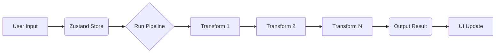

# FluxText Code Documentation

Welcome to the technical documentation for FluxText—a developer-first, offline-first text transformation engine.

## 1. Project Overview
FluxText is built on **React 19**, **TypeScript**, and **Vite**. It uses a state-driven pipeline to allow users to chain multiple text transformations together in real-time.

---

## 2. File & Folder Structure

```text
|-- frontend/
|   |-- public/              # Static assets (favicons, manifest)
|   |-- src/
|       |-- components/      # UI components (CommandPalette, PipelineEditor, etc.)
|       |-- core/            # Business logic / transformation engine
|       |-- store/           # Global state management using Zustand
|       |-- assets/          # Project images and global icons
|       |-- App.tsx          # Main application entry and layout
|       |-- main.tsx         # React DOM mount point
|       |-- index.css        # Global styles and design system variables
|-- LaunchFluxText.bat       # Windows launcher
|-- LaunchFluxText.sh        # Unix/macOS launcher
|-- CONTRIBUTING.md          # Contribution guidelines
|-- LICENSE                  # GPL v3 License
```

---

## 3. High-Level Architecture
FluxText follows a **Unidirectional Data Flow** pattern:

1.  **State (Zustand)**: Stores `inputText`, `pipeline` (array of transformation names), and `theme`.
2.  **Engine (Core)**: A functional transformation engine that takes `inputText` + `pipeline` and returns transformed `outputText`.
3.  **UI (React)**: Renders the input textarea, the dynamic pipeline editor, and the real-time output.

---

## 4. Core Modules

| Module | Location | Description |
| :--- | :--- | :--- |
| **Transform Engine** | `src/core/engine.ts` | The core mapping logic that connects pipeline names to transformation functions. |
| **Helper Maps** | `src/core/helpers.ts` | Extensive lookup tables for Morse, NATO, and complex Unicode font styles. |
| **App Store** | `src/store/useAppStore.ts` | Zustand store managing `inputText`, `pipeline`, `theme`, and `isQuickActionsExpanded`. |
| **Pipeline Editor** | `src/components/PipelineEditor.tsx` | Interactive UI for managing the chain of active transformations. |
| **Quick Actions** | `src/components/QuickActions.tsx` | A categorized, collapsable grid of one-click transformation shortcuts. |
| **Command Palette** | `src/components/CommandPalette.tsx` | Highly optimized keyboard interface using `useDeferredValue` and `memo` for instant searching. |

---

## 5. Data Flow (Execution)



---

## 6. Dependencies

### Runtime Dependencies
- **React 19**: Frontend framework.
- **Zustand**: Fast, scalable state management.
- **Lucide-React**: Modern icon set.
- **Framer Motion**: Smooth animations for the UI.

### Dev Dependencies
- **TypeScript**: Static typing for reliability.
- **Vite**: Ultra-fast build tool and dev server.
- **ESLint**: Standardized code quality checking.
